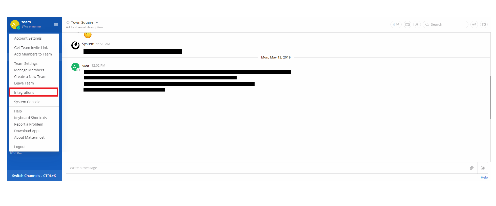
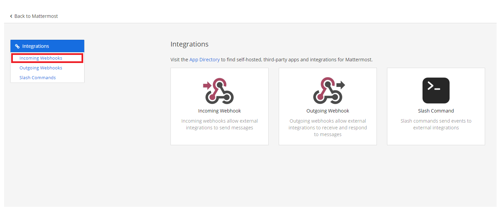
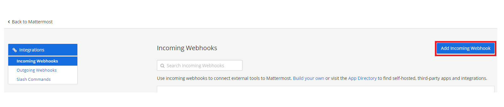
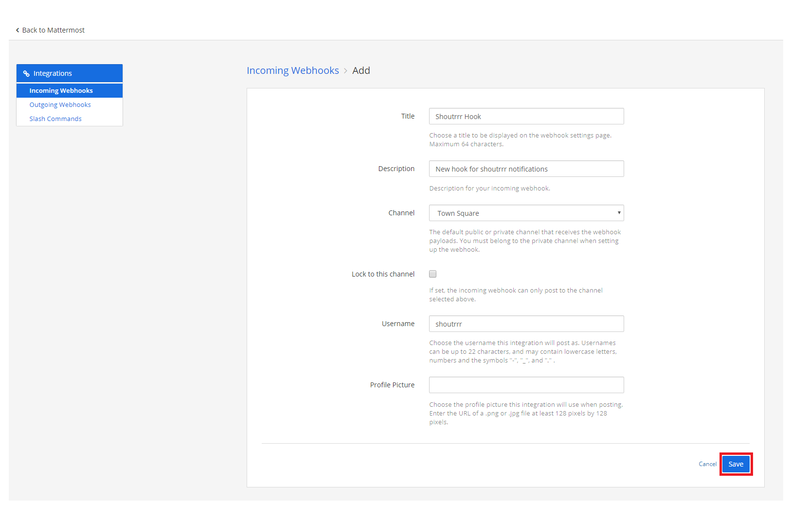
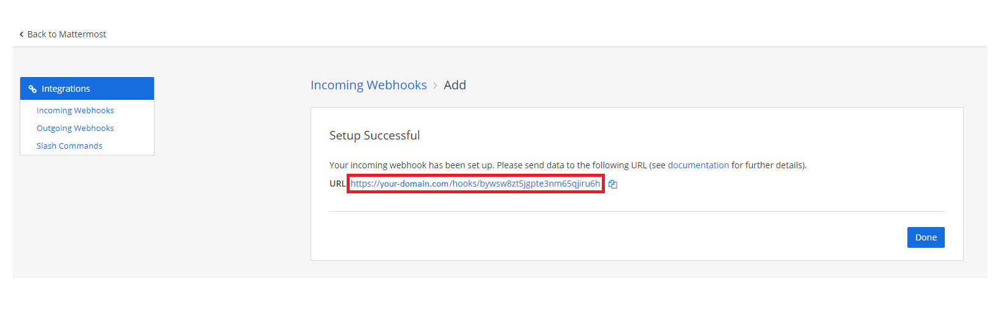

# MatterMost

## URL Format

:::info
mattermost://[__`username`__@]__`mattermost-host`__/__`token`__[/__`channel`__][?icon=__`smiley`__]
:::

### URL Fields

*  __UserName__ - Override webhook user  
  Default: *empty*  
  URL part: <code class="service-url">mattermost://<strong>username</strong>@host:port/token/channel</code>  
*  __Host__ - Mattermost server host (**Required**)  
  URL part: <code class="service-url">mattermost://username@<strong>host</strong>:<strong>port</strong>/token/channel</code>  
*  __Token__ - Webhook token (**Required**)  
  URL part: <code class="service-url">mattermost://username@host:port/<strong>token</strong>/channel</code>  
*  __Channel__ - Override webhook channel  
  Default: *empty*  
  URL part: <code class="service-url">mattermost://username@host:port/token/<strong>channel</strong></code>  
### Query/Param Props

Props can be either supplied using the params argument, or through the URL using  
`?key=value&key=value` etc.

*  __Icon__ - Use emoji or URL as icon (based on presence of http(s):// prefix)  
  Default: *empty*  
  Aliases: `icon_emoji`, `icon_url`  

*  __Title__ - Notification title, optionally set by the sender (not used)  
  Default: *empty*


## Creating a Webhook in MatterMost

1. Open up the Integrations page by clicking on *Integrations* within the menu


2. Click *Incoming Webhooks*


3. Click *Add Incoming Webhook*


4. Fill in the information for the webhook and click *Save*


5. If you did everything correctly, MatterMost will give you the *URL* to your newly created webhook


6. Format the service URL
```
https://your-domain.com/hooks/bywsw8zt5jgpte3nm65qjiru6h
                              └────────────────────────┘
                                        token
mattermost://your-domain.com/bywsw8zt5jgpte3nm65qjiru6h
                             └────────────────────────┘
                                       token
```

## Additional URL configuration

Mattermost provides functionality to post as another user or to another channel, compared to the webhook configuration.
<br/>
To do this, you can add a *user* and/or *channel* to the service URL.

```
mattermost://shoutrrrUser@your-domain.com/bywsw8zt5jgpte3nm65qjiru6h/shoutrrrChannel
             └──────────┘                 └────────────────────────┘ └─────────────┘
                 user                               token                channel
```

## Passing parameters via code

If you want to, you also have the possibility to pass parameters to the `send` function.
<br/>
The following example contains all parameters that are currently supported.

```text
params := (*types.Params)(
	&map[string]string{
		"username": "overwriteUserName",
		"channel": "overwriteChannel",
        "icon": "overwriteIcon",
	},
)

service.Send("this is a message", params)
```

This will overwrite any options, that you passed via URL.