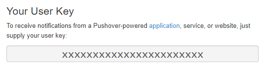
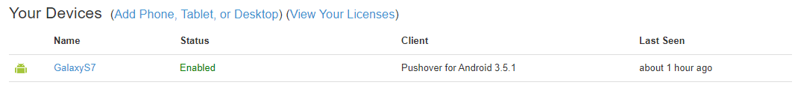
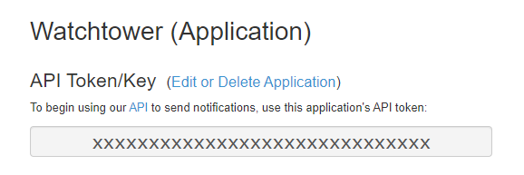

# Pushover

## URL Format

:::info
pushover://shoutrrr:__`apiToken`__@__`userKey`__/?devices=__`device1`__[,__`device2`__, ...]
:::

### URL Fields

*  __Token__ - API Token/Key (**Required**)  
  URL part: <code class="service-url">pushover://:<strong>token</strong>@user/</code>  
*  __User__ - User Key (**Required**)  
  URL part: <code class="service-url">pushover://:token@<strong>user</strong>/</code>  
### Query/Param Props

Props can be either supplied using the params argument, or through the URL using  
`?key=value&key=value` etc.

*  __Devices__  
  Default: *empty*  

*  __Priority__  
  Default: `0`  

*  __Title__  
  Default: *empty*

## Getting the keys from Pushover

At your [Pushover dashboard](https://pushover.net/) you can view your __`userKey`__ in the top right.  

The `Name` column of the device list is what is used to refer to your devices (__`device1`__ etc.)

At the bottom of the same page there are links your _applications_, where you can find your __`apiToken`__

The __`apiToken`__ is displayed at the top of the application page.

## Optional parameters

You can optionally specify the __`title`__ and __`priority`__ parameters in the URL:  
*pushover://shoutrrr:__`token`__@__`userKey`__/?devices=__`device`__&title=Custom+Title&priority=1*

:::info
Only supply priority values between -1 and 1, since 2 requires additional parameters that are not supported yet.
:::

Please refer to the [Pushover API documentation](https://pushover.net/api#messages) for more information.  
