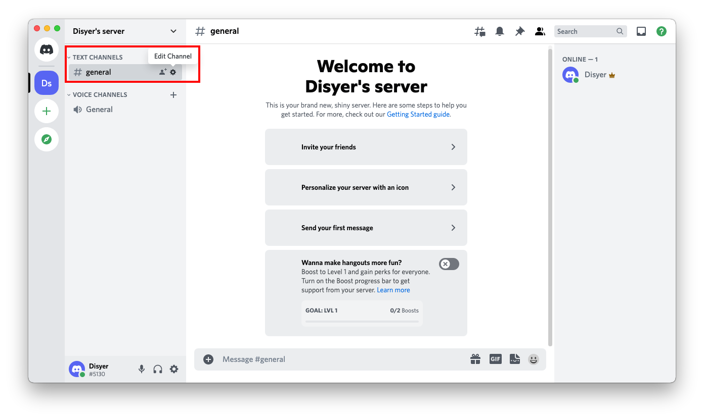
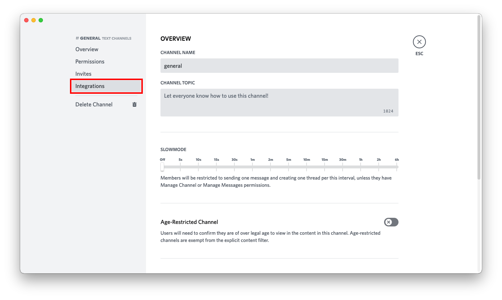
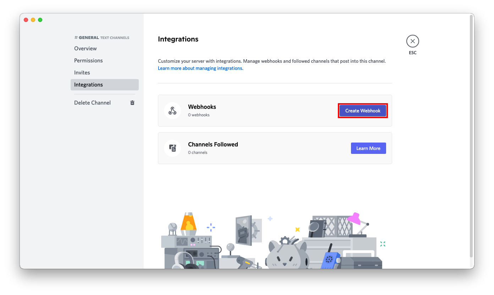
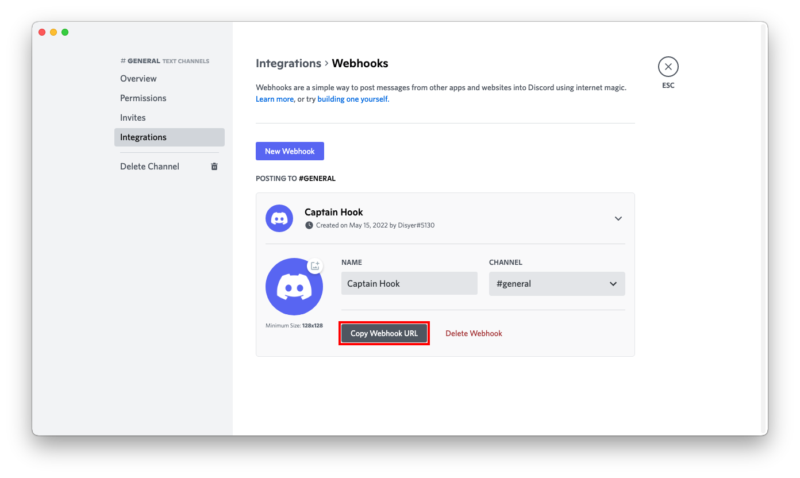
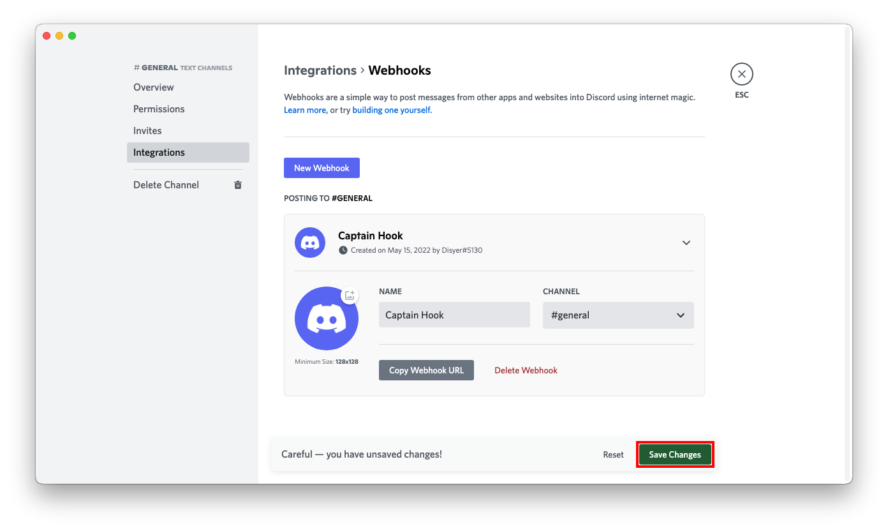

# Discord

## URL 格式

:::info
<span>https://</span>discord.com/api/webhooks/__`webhookid`__/__`token`__
:::

shoutrrr 服务 URL 应如下所示：

:::info
discord://__`token`__@__`webhookid`__
:::

### URL 字段

*  __Token__ （**必填**）  
  URL 位置：<code class="service-url">discord://<strong>token</strong>@webhookid/</code>  
*  __WebhookID__ （**必填**）  
  URL 位置：<code class="service-url">discord://token@<strong>webhookid</strong>/</code>  
### 查询参数

这些参数既可以通过 params 参数传入，也可以直接通过 URL 传入：
`?key=value&key=value` etc.

*  __Avatar__ - Override the webhook default avatar with specified URL  
  默认值：*empty*  
  别名：`avatarurl`  

*  __Color__ - The color of the left border for plain messages  
  默认值：`0x50D9ff`  

*  __ColorDebug__ - The color of the left border for debug messages  
  默认值：`0x7b00ab`  

*  __ColorError__ - The color of the left border for error messages  
  默认值：`0xd60510`  

*  __ColorInfo__ - The color of the left border for info messages  
  默认值：`0x2488ff`  

*  __ColorWarn__ - The color of the left border for warning messages  
  默认值：`0xffc441`  

*  __JSON__ - Whether to send the whole message as the JSON payload instead of using it as the 'content' field  
  默认值：❌ `No`  

*  __SplitLines__ - Whether to send each line as a separate embedded item  
  默认值：✔ `Yes`  

*  __ThreadID__ - Optional thread ID for posting into a channel thread  
  默认值：*empty*  

*  __Title__  
  默认值：*empty*  

*  __Username__ - Override the webhook default username  
  默认值：*empty*

:::info
:::

### 示例

```
discord://<token>@<webhook_id>?thread_id=1234567890123456789
```

获取 thread ID 的方法：
 - 打开一个 Discord 帖子（Thread）
 - 右键 -> 复制链接
 - 或者右键 -> 复制帖子 ID（需要在 Discord 设置中开启开发者模式）

:::warning
有效的 thread_id 必须是 19 位数字。从链接中提取时，不要把频道 ID 和帖子 ID 搞混。
:::

## 在 Discord 中创建 Webhook

1. 点击频道名称旁边的齿轮图标，打开频道设置。


2. 在左侧菜单中点击 *Integrations*。


3. 在右侧菜单中点击 *Create Webhook*。


4. 按喜好设置名称、频道和图标，然后点击 *Copy Webhook URL* 按钮。


5. 点击 *Save Changes* 按钮。


6. 拼装服务 URL：
```
https://discord.com/api/webhooks/693853386302554172/W3dE2OZz4C13_4z_uHfDOoC7BqTW288s-z1ykqI0iJnY_HjRqMGO8Sc7YDqvf_KVKjhJ
                                 └────────────────┘ └──────────────────────────────────────────────────────────────────┘
                                     webhook id                                    token

discord://W3dE2OZz4C13_4z_uHfDOoC7BqTW288s-z1ykqI0iJnY_HjRqMGO8Sc7YDqvf_KVKjhJ@693853386302554172
          └──────────────────────────────────────────────────────────────────┘ └────────────────┘
                                          token                                    webhook id
```
