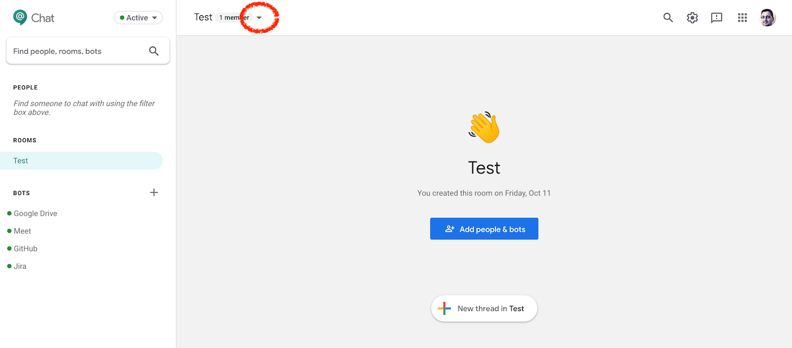
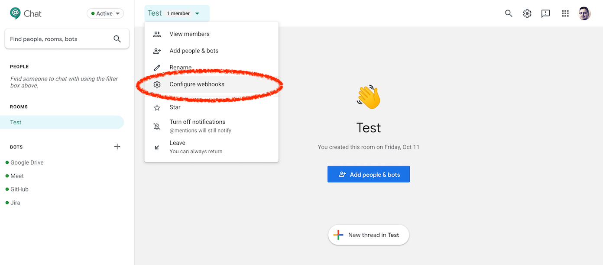
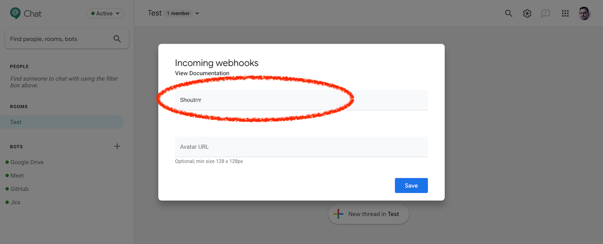
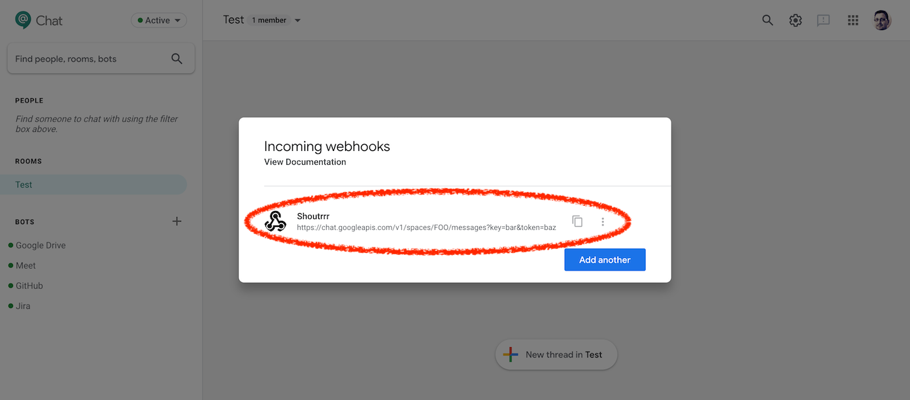

# Google Chat

## URL 格式

你的 Google Chat 传入 Webhook URL 长这样：

:::info
https://chat.googleapis.com/v1/spaces/__`FOO`__/messages?key=__`bar`__&token=__`baz`__
:::

shoutrrr 服务 URL 应如下所示：

:::info
googlechat://chat.googleapis.com/v1/spaces/__`FOO`__/messages?key=__`bar`__&token=__`baz`__
:::

换句话说，就是把传入 Webhook URL 中的 `https` 替换为 `googlechat`。

Google Chat 此前名为 Hangouts Chat。在服务 URL 中使用 `hangouts` 代替 `googlechat` 仍然受支持，但已被弃用。

## 在 Google Chat 中创建传入 Webhook

1. 打开你想添加 Shoutrrr 的聊天室，并打开聊天室菜单。

2. 然后点击 *Configure webhooks*。

3. 为 Webhook 命名并保存。

4. 复制该 URL。

5. 把 URL 中的 `https` 替换为 `googlechat`，得到服务 URL。
