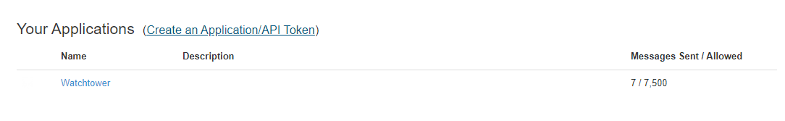

# Pushover

## URL 格式

:::info
pushover://shoutrrr:__`apiToken`__@__`userKey`__/?devices=__`device1`__[,__`device2`__, ...]
:::

### URL 字段

*  __Token__ - API Token/Key （**必填**）  
  URL 位置：<code class="service-url">pushover://:<strong>token</strong>@user/</code>  
*  __User__ - User Key （**必填**）  
  URL 位置：<code class="service-url">pushover://:token@<strong>user</strong>/</code>  
### 查询参数

这些参数既可以通过 params 参数传入，也可以直接通过 URL 传入：
`?key=value&key=value` etc.

*  __Devices__  
  默认值：*empty*  

*  __Priority__  
  默认值：`0`  

*  __Title__  
  默认值：*empty*

## 从 Pushover 获取密钥

在 [Pushover 控制台](https://pushover.net/)，你可以在右上角查看你的 __`userKey`__。

设备列表中的 `Name` 列就是引用你的设备时使用的名称（__`device1`__ 等）。

同一页面底部有你的_应用_链接，在那里可以找到你的 __`apiToken`__。

__`apiToken`__ 显示在应用页面顶部。

## 可选参数

你可以在 URL 中可选地指定 __`title`__ 和 __`priority`__ 参数：
*pushover://shoutrrr:__`token`__@__`userKey`__/?devices=__`device`__&title=Custom+Title&priority=1*

:::info
priority 只能传 -1 到 1 之间的值，因为 2 需要一些目前尚不支持的额外参数。
:::

更多信息请参考 [Pushover API 文档](https://pushover.net/api#messages)。
