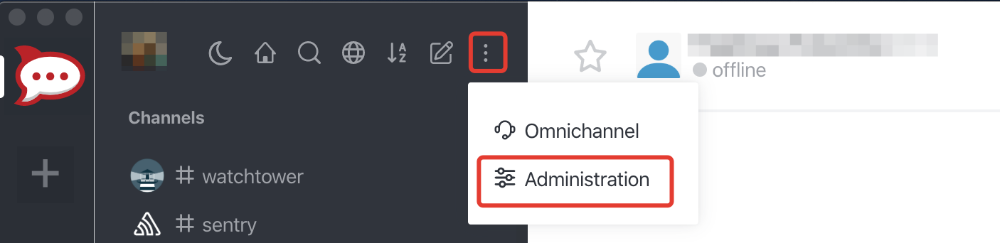
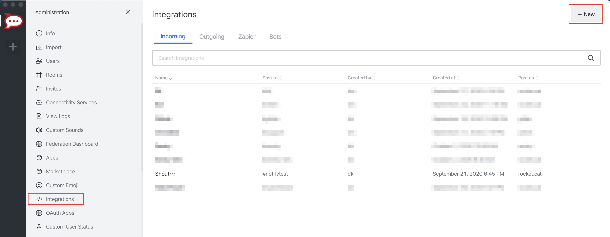
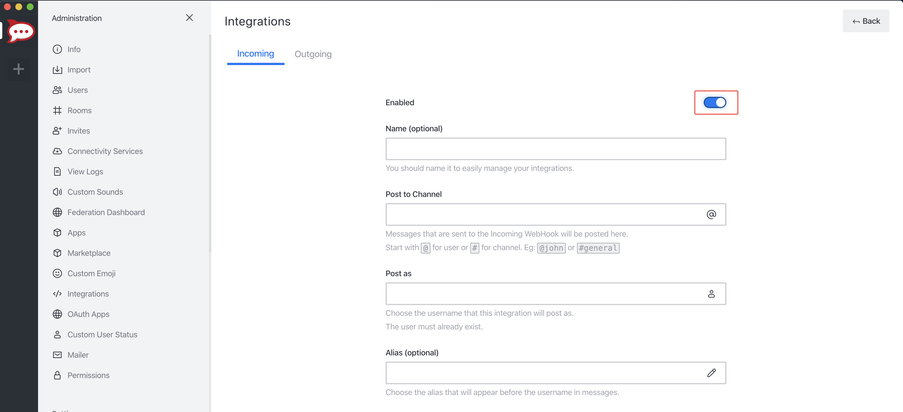
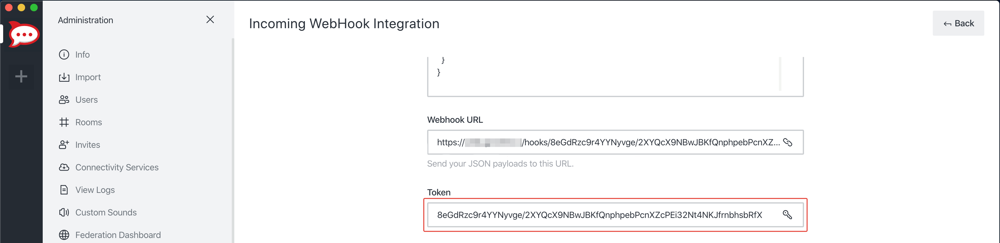

# Rocket.chat

## URL 格式

:::info
rocketchat://[__`username`__@]__`rocketchat-host`__/__`token`__[/__`channel`&#124;`@recipient`__]*
:::

### URL 字段

*  __UserName__  
  默认值：*empty*  
  URL 位置：<code class="service-url">rocketchat://<strong>username</strong>@host:port/tokena/tokenb/channel</code>  
*  __Host__ （**必填**）  
  URL 位置：<code class="service-url">rocketchat://username@<strong>host</strong>:port/tokena/tokenb/channel</code>  
*  __Port__ （**必填**）  
  URL 位置：<code class="service-url">rocketchat://username@host:<strong>port</strong>/tokena/tokenb/channel</code>  
*  __TokenA__ （**必填**）  
  URL 位置：<code class="service-url">rocketchat://username@host:port/<strong>tokena</strong>/tokenb/channel</code>  
*  __TokenB__ （**必填**）  
  URL 位置：<code class="service-url">rocketchat://username@host:port/tokena/<strong>tokenb</strong>/channel</code>  
*  __Channel__ （**必填**）  
  URL 位置：<code class="service-url">rocketchat://username@host:port/tokena/tokenb/<strong>channel</strong></code>  
### 查询参数

*The services does not support any query/param props*

## 在 Rocket.chat 中创建 Webhook

1. 点击 *Administration* 菜单，打开聊天管理界面


2. 打开 *Integrations*，然后点击 *New*


3. 填写 Webhook 信息并点击 *Save*。别忘了启用（Enable）你的集成。


5. 如果一切操作正确，Rocket.chat 会给你新建 Webhook 的 *URL* 和 *Token*。


6. 拼装服务 URL
```
rocketchat://your-domain.com/8eGdRzc9r4YYNyvge/2XYQcX9NBwJBKfQnphpebPcnXZcPEi32Nt4NKJfrnbhsbRfX
                             └────────────────────────────────────────────────────────────────┘
                                                           token
```

## 附加 URL 配置

与 Webhook 配置相比，Rocket.chat 支持以其他用户身份发帖，或发到其他频道/用户。
<br/>
为此，你可以在服务 URL 中添加 *sender* 和/或 *channel* / *receiver*。

```
rocketchat://shoutrrrUser@your-domain.com/8eGdRzc9r4YYNyvge/2XYQcX9NBwJBKfQnphpebPcnXZcPEi32Nt4NKJfrnbhsbRfX/shoutrrrChannel
             └──────────┘                 └────────────────────────────────────────────────────────────────┘ └─────────────┘
                sender                                                   token                                   channel

rocketchat://shoutrrrUser@your-domain.com/8eGdRzc9r4YYNyvge/2XYQcX9NBwJBKfQnphpebPcnXZcPEi32Nt4NKJfrnbhsbRfX/@shoutrrrReceiver
             └──────────┘                 └────────────────────────────────────────────────────────────────┘ └───────────────┘
                sender                                                   token                                    receiver
```

## 通过代码传参

如果需要，你也可以向 `send` 函数传参。
<br/>
下面的示例包含当前支持的全部参数。

```text
params := (*types.Params)(
	&map[string]string{
		"username": "overwriteUserName",
		"channel": "overwriteChannel",
	},
)

service.Send("this is a message", params)
```

这会覆盖你通过 URL 传入的所有选项。

更多 Rocket.chat Webhook 选项参见[官方指南](https://docs.rocket.chat/guides/administrator-guides/integrations)。
