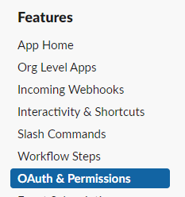
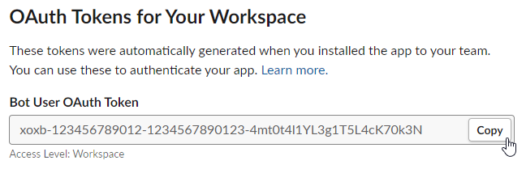
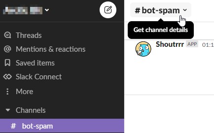
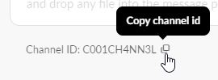

# Slack 指南

配置 [Slack](/zh/services/slack) 服务的操作指南。

## 获取令牌

要启用全部功能，需要使用旧版 Webhook 令牌（已弃用，可能随时失效）或 Bot API 令牌。如果不需要自定义机器人名称或图标，用非旧版的 Webhook 即可。

### Bot API（推荐）

1. 按照[应用创建基础指南](https://api.slack.com/authentication/basics)为你的机器人创建一个新 App
2. 把 App 安装到你的工作区（[Slack 文档](https://api.slack.com/authentication/basics#installing)）。
3. 在 [Apps](https://api.slack.com/apps) 中选择你的新 App，进入 **Oauth & Permissions**
   
4. 复制 Bot User OAuth Token
   

:::tip 示例
给定 API 令牌
<pre><code><b>xoxb</b>-<b>123456789012</b>-<b>1234567890123</b>-<b>4mt0t4l1YL3g1T5L4cK70k3N</b></code></pre>
和频道 ID `C001CH4NN3L`（通过[下面的指南](#getting_the_channel_id)获取），Shoutrrr URL 应如下所示：
<pre><code>slack://<b>xoxb</b>:<b>123456789012</b>-<b>1234567890123</b>-<b>4mt0t4l1YL3g1T5L4cK70k3N</b>@<b>C001CH4NN3L</b></code></pre>
:::

### Webhook 令牌

通过旧版 [WebHooks Integration](https://slack.com/apps/new/A0F7XDUAZ-incoming-webhooks) 或
[Incoming Webhooks 入门指南](https://api.slack.com/messaging/webhooks#getting_started) 获取一个 Webhook URL，
并把 URL 开头的 `https://hooks.slack.com/services/` 部分替换为 `slack://hook:`，即得到你的 Shoutrrr URL。

:::info Slack Webhook URL
<code>https://hooks.slack.com/services/<b>T00000000</b>/<b>B00000000</b>/<b>XXXXXXXXXXXXXXXXXXXXXXXX</b></code>
:::

:::info Shoutrrr URL
<code>slack://hook:<b>T00000000</b>-<b>B00000000</b>-<b>XXXXXXXXXXXXXXXXXXXXXXXX</b>@webhook</code>
:::

## 获取频道 ID

:::info
只有 API 令牌需要这一步。Webhook 令牌的频道直接用 `webhook`。
:::

1. 在你想发消息的频道中，点击频道标题打开 **Channel Details**。
   

2. 从弹窗底部复制频道 ID，追加到你的 Shoutrrr URL 末尾
   
